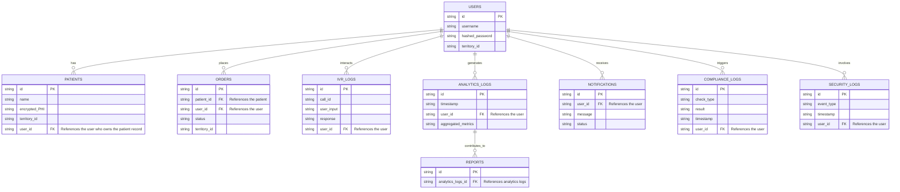

# Database Schema Overview

Below is the Mermaid ERD diagram for the project's database schema, based on the current setup.

This diagram visualizes the relationships between the key tables in the database. 