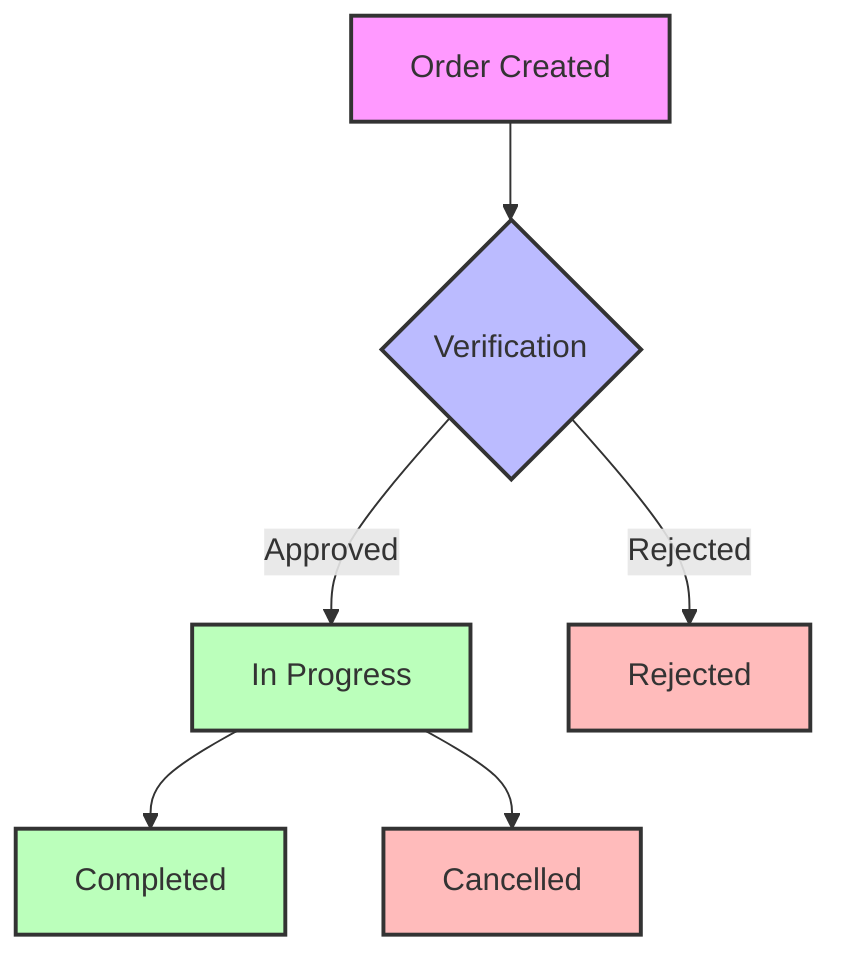

# Order Workflow Documentation

## Overview
The Order Workflow system manages the complete lifecycle of medical orders, from creation to delivery, with HIPAA-compliant data handling and territory-based access control.

The primary user interface for order management (especially for roles like Master Distributor) presents a streamlined three-stage status progression for core fulfillment: **Pending → Preparing → Shipped**. This UI flow is a simplified representation of the more detailed backend status machine outlined below. For example, "Pending" in the UI may cover backend states like "Order Created" and parts of "Verification", while "Preparing" aligns with "In Progress" before actual shipment, and "Shipped" is a clear state transition. The detailed workflow below encompasses all possible states and transitions managed by the backend system.

## Status Flow



## Status Definitions

### 1. Order Created
- Initial state when order is submitted
- Requires basic validation
- Triggers verification workflow
- Generates order ID and audit log

### 2. Verification
- Validates order details
- Checks insurance coverage
- Verifies provider credentials
- Confirms territory assignment

### 3. In Progress
- Order is being processed
- Tracks fulfillment status
- Manages shipping details
- Handles real-time updates

### 4. Completed
- Order successfully delivered
- Confirmation received
- Documentation archived
- Audit trail completed

### 5. Rejected
- Failed verification
- Invalid data
- Insurance issues
- Territory mismatch

### 6. Cancelled
- User-initiated cancellation
- System cancellation
- Requires reason documentation
- Maintains audit trail

## Status Transition Rules

### Valid Transitions
1. Order Created → Verification
2. Verification → In Progress (if approved)
3. Verification → Rejected (if failed)
4. In Progress → Completed
5. In Progress → Cancelled
6. Any state → Cancelled (with proper authorization)

### Transition Requirements
- Territory validation
- User authorization
- Audit logging
- Status history tracking
- Real-time notifications

## Security & Compliance

### HIPAA Compliance
- PHI encryption at rest
- Secure transmission
- Access logging
- Audit trail maintenance

### Territory Controls
- Territory-based access
- Cross-territory validation
- Boundary enforcement
- Access logging

### Audit Requirements
- Status change logging
- User action tracking
- PHI access records
- Compliance reporting

## Real-time Features

### WebSocket Integration
- Status updates
- Order notifications
- Territory alerts
- System events

### Notification System
- Email notifications
- SMS alerts
- In-app messages
- Webhook integration

## Database Structure

### Order Table
```sql
CREATE TABLE orders (
    id UUID PRIMARY KEY,
    patient_id UUID REFERENCES patients(id),
    provider_id UUID REFERENCES providers(id),
    territory_id UUID REFERENCES territories(id),
    status VARCHAR(50),
    created_at TIMESTAMP,
    updated_at TIMESTAMP,
    encrypted_data JSONB,
    audit_log JSONB
);
```

### Status History Table
```sql
CREATE TABLE order_status_history (
    id UUID PRIMARY KEY,
    order_id UUID REFERENCES orders(id),
    previous_status VARCHAR(50),
    new_status VARCHAR(50),
    changed_by UUID REFERENCES users(id),
    changed_at TIMESTAMP,
    reason TEXT,
    territory_id UUID REFERENCES territories(id)
);
```

## API Endpoints

### Order Management
```http
POST /api/v1/orders
PUT /api/v1/orders/{order_id}/status
GET /api/v1/orders/{order_id}
GET /api/v1/orders/territory/{territory_id}
```

### Status Management
```http
PUT /api/v1/orders/{order_id}/verify
PUT /api/v1/orders/{order_id}/complete
PUT /api/v1/orders/{order_id}/cancel
```

## Error Handling

### Validation Errors
- Invalid status transition
- Missing required data
- Territory mismatch
- Authorization failure

### System Errors
- Database connection issues
- External service failures
- Notification delivery failures
- WebSocket disconnections

## Testing Requirements

### Unit Tests
- Status transition validation
- Territory access control
- Data encryption
- Audit logging

### Integration Tests
- API endpoint validation
- WebSocket communication
- Notification delivery
- Database operations

### E2E Tests
- Complete order workflow
- Error handling scenarios
- Real-time updates
- Territory isolation

## Monitoring

### Key Metrics
- Order processing time
- Status transition frequency
- Error rates
- Territory activity

### Alerts
- Failed transitions
- System errors
- Security violations
- Performance issues

## Future Enhancements

### Planned Features
1. AI-powered status prediction
2. Automated territory optimization
3. Enhanced real-time analytics
4. Advanced reporting capabilities

### Optimization Goals
1. Reduce processing time
2. Improve error handling
3. Enhance real-time capabilities
4. Strengthen security measures

## Implementation Notes

### Critical Paths
1. Status transition validation
2. Territory access control
3. Real-time updates
4. Audit logging

### Dependencies
1. WebSocket service
2. Notification system
3. Territory service
4. Audit service

### Configuration
1. Status definitions
2. Transition rules
3. Territory boundaries
4. Notification templates 