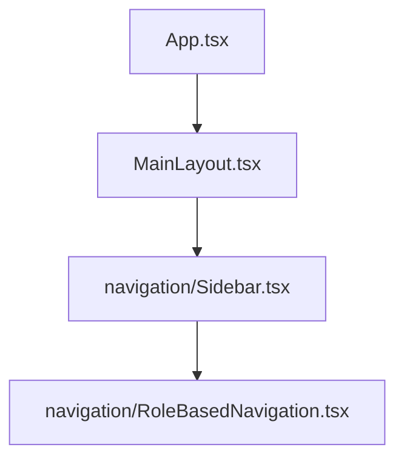

# Dashboard Component Structure

## Component Hierarchy



## Key Components

### Primary Navigation
- **Location:** `frontend/src/components/navigation/Sidebar.tsx`
- **Child Component:** `RoleBasedNavigation.tsx`
- **Styling Control:** Material-UI (MUI) based implementation

### Design System

#### Colors
- Primary Blue: `#375788` (Used for active states, CTAs)
- Dark Background: `#2C3E50` (Sidebar background)
- Text Colors:
  - Active: `#ffffff` (100% white)
  - Inactive: `rgba(255, 255, 255, 0.7)` (70% white)
  - Hover: `rgba(55, 87, 136, 0.2)` (#375788 with 20% opacity)

#### Dimensions
- Sidebar Width: 280px
- Logo Height: 128px (h-32)

## Important Notes

### ⚠️ Component Disambiguation
There are multiple sidebar implementations in the codebase:
- ✅ **CORRECT:** `frontend/src/components/navigation/Sidebar.tsx` (MUI-based)
- ❌ **UNUSED:** `frontend/src/components/shared/layout/Sidebar.tsx` (Tailwind-based)

### Styling Guidelines
1. Use Material-UI's `sx` prop for styling
2. Follow the established color scheme
3. Maintain consistent hover/active states
4. Keep text contrast WCAG compliant

### Navigation Items
- Controlled by `navigationConfig` in `RoleBasedNavigation.tsx`
- Role-based access control built in
- Support for nested navigation items

## Future Styling Changes

When making dashboard styling changes:

1. **Primary Component:**
   ```typescript
   frontend/src/components/navigation/Sidebar.tsx
   frontend/src/components/navigation/RoleBasedNavigation.tsx
   ```

2. **Style Application:**
   - Use MUI's `sx` prop system
   - Follow existing patterns for hover/active states
   - Maintain HIPAA-compliant color contrast

3. **Testing:**
   - Test across all user roles
   - Verify nested navigation styling
   - Check responsive behavior

## Recent Changes

### March 2024 - Sidebar Styling Update
- Standardized blue color scheme (#375788)
- Fixed logo sizing to match login page (h-32)
- Improved text contrast and visibility
- Updated hover/active states for consistency 