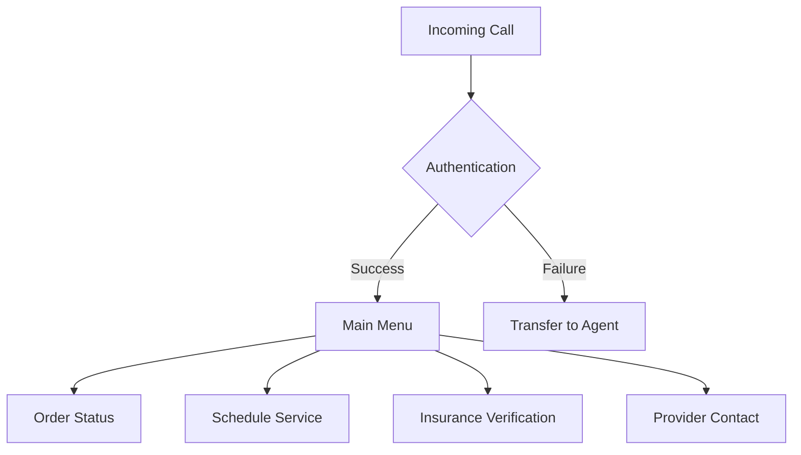

# IVR (Interactive Voice Response) System

## Overview
The IVR System provides an automated telephone interface for patients and providers to interact with the healthcare platform, featuring HIPAA-compliant call handling, voice authentication, and real-time integration with the order management system.

## Core Features

### Call Flow


## System Architecture

### Components
```python
class IVRSystem:
    def __init__(self, territory_id: str):
        self.territory_id = territory_id
        self.call_handler = CallHandler()
        self.voice_auth = VoiceAuthentication()
        self.menu_system = MenuSystem()
        self.order_service = OrderService(territory_id)
```

### Call Handling
```python
class CallHandler:
    async def handle_incoming_call(
        self,
        call_id: str,
        phone_number: str
    ) -> CallSession:
        # Create secure call session
        session = await self.create_session(call_id)
        
        # Identify territory
        territory = await self.identify_territory(phone_number)
        
        # Initialize voice authentication
        await self.init_voice_auth(session)
        
        return session
```

## Voice Authentication

### Authentication Flow
```python
class VoiceAuthentication:
    async def authenticate_caller(
        self,
        call_session: CallSession,
        voice_sample: bytes
    ) -> AuthResult:
        # Verify voice biometrics
        voice_match = await self.verify_voice(
            voice_sample,
            call_session.enrolled_voice
        )
        
        # Validate caller identity
        if voice_match.confidence > 0.95:
            await self.authorize_session(call_session)
            return AuthResult(success=True)
        
        return AuthResult(
            success=False,
            transfer_to_agent=True
        )
```

## Menu System

### Menu Configuration
```typescript
interface IVRMenu {
  id: string;
  prompts: {
    welcome: string;
    options: string[];
    invalid: string;
    timeout: string;
  };
  options: {
    [key: string]: {
      action: string;
      next_menu?: string;
      requires_auth?: boolean;
    };
  };
}

const mainMenu: IVRMenu = {
  id: 'main',
  prompts: {
    welcome: 'Welcome to Healthcare Services',
    options: [
      'Press 1 for Order Status',
      'Press 2 to Schedule Service',
      'Press 3 for Insurance Verification',
      'Press 4 to Contact Provider'
    ],
    invalid: 'Invalid selection',
    timeout: 'No input received'
  },
  options: {
    '1': {
      action: 'check_order_status',
      requires_auth: true
    },
    '2': {
      action: 'schedule_service',
      requires_auth: true
    },
    '3': {
      action: 'verify_insurance',
      requires_auth: true
    },
    '4': {
      action: 'contact_provider',
      requires_auth: false
    }
  }
};
```

## Integration Points

### Order Status Check
```python
class OrderStatusHandler:
    async def check_status(
        self,
        call_session: CallSession,
        order_id: str
    ) -> VoiceResponse:
        # Verify caller authorization
        await self.verify_caller_access(
            call_session,
            order_id
        )
        
        # Get order status
        order = await self.order_service.get_order(order_id)
        
        # Generate voice response
        return self.generate_status_response(order)
```

### Service Scheduling
```python
class ServiceScheduler:
    async def schedule_service(
        self,
        call_session: CallSession,
        service_request: dict
    ) -> OrderResponse:
        # Create order
        order = await self.order_service.create_order({
            'patient_id': call_session.patient_id,
            'service_type': service_request.type,
            'requested_date': service_request.date,
            'territory_id': call_session.territory_id
        })
        
        # Schedule confirmation call
        await self.schedule_confirmation(order)
        
        return OrderResponse(
            order_id=order.id,
            confirmation_code=order.tracking_id
        )
```

## Security Features

### Call Security
- Voice biometric authentication
- Territory validation
- Call recording encryption
- PHI handling compliance

### Audit Trail
```typescript
interface IVRCallEvent {
  timestamp: string;
  call_id: string;
  territory_id: string;
  patient_id?: string;
  action: string;
  result: string;
  duration: number;
  authentication_method: string;
}
```

## Error Handling

### Common Errors
```json
{
  "status": "error",
  "error": {
    "code": "AUTHENTICATION_FAILED",
    "message": "Voice authentication failed",
    "details": {
      "call_id": "string",
      "retry_count": 2,
      "transfer_to_agent": true
    }
  }
}
```

### Error Codes
- `AUTHENTICATION_FAILED`: Voice auth failed
- `INVALID_SELECTION`: Menu selection error
- `ORDER_NOT_FOUND`: Order lookup failed
- `TERRITORY_MISMATCH`: Wrong territory
- `SYSTEM_ERROR`: Technical issues

## Performance Monitoring

### Metrics
```typescript
interface IVRMetrics {
  calls_per_minute: number;
  average_call_duration: number;
  authentication_success_rate: number;
  menu_completion_rate: number;
  transfer_rate: number;
  error_rate: number;
}
```

### Call Quality
- Voice clarity monitoring
- Network latency tracking
- Error rate analysis
- User satisfaction metrics

## Integration Testing

### Test Cases
```python
class IVRTestSuite:
    async def test_call_flow(self):
        # Test authentication
        call = await self.simulate_call()
        auth = await call.authenticate()
        assert auth.success
        
        # Test menu navigation
        menu = await call.access_menu()
        response = await menu.select_option('1')
        assert response.valid
        
        # Test order status
        status = await call.check_order_status('ORDER123')
        assert status.found
```

## Deployment Considerations
- Call center integration
- Voice model training
- Territory-specific routing
- Disaster recovery
- Load balancing 