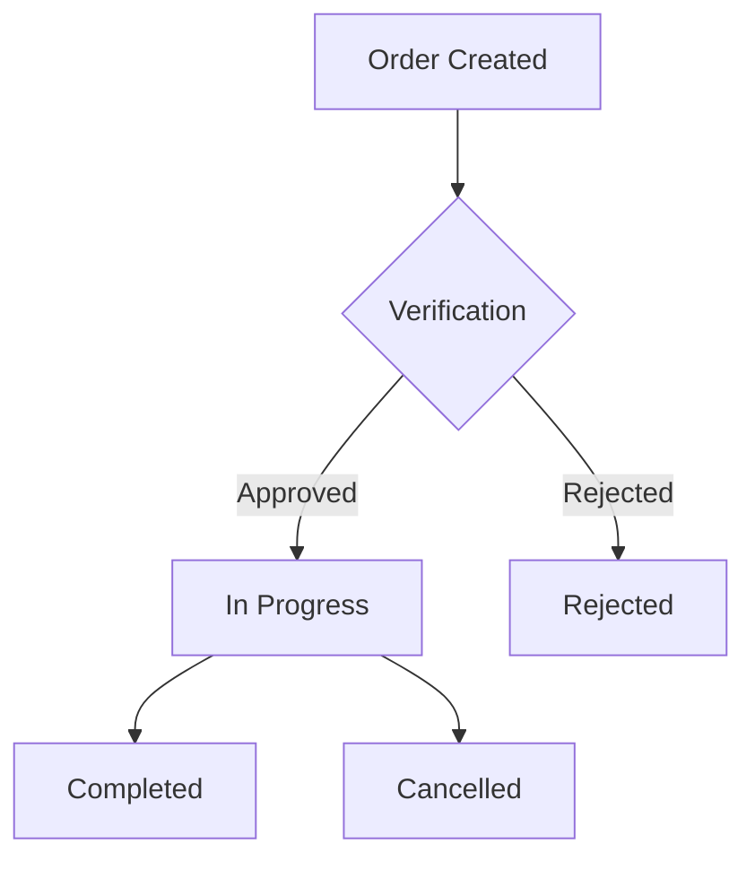

# Order Management System

## Overview
The Order Management System handles the creation, tracking, and processing of medical orders with real-time status updates and HIPAA-compliant data handling.

## Core Features

### Order Workflow


## Data Model

### Order Schema
```python
@phi_protected
class Order(BaseModel):
    id: str
    territory_id: str
    
    # Relationships (Non-PHI)
    patient_id: str
    provider_id: str
    
    # Order Details (Encrypted)
    service_type: EncryptedStr
    diagnosis_codes: List[EncryptedStr]
    notes: EncryptedStr
    
    # Insurance Information (Encrypted)
    insurance_verification: EncryptedJSON = {
        "status": str,
        "coverage_details": dict,
        "authorization_number": str
    }
    
    # Status Information (Non-PHI)
    status: str
    created_at: datetime
    updated_at: datetime
    
    class Config:
        encryption_context = ['territory_id']
```

## API Endpoints

### Create Order
```http
POST /api/v1/orders
Content-Type: application/json
Authorization: Bearer {token}
Territory-Id: {territory_id}

{
  "patient_id": "string",
  "provider_id": "string",
  "service_type": "string",
  "diagnosis_codes": ["string"],
  "notes": "string",
  "insurance": {
    "carrier": "string",
    "policy_number": "string",
    "group_number": "string"
  }
}
```

### Update Order Status
```http
PUT /api/v1/orders/{order_id}/status
Content-Type: application/json
Authorization: Bearer {token}
Territory-Id: {territory_id}

{
  "status": "verified|rejected|in_progress|completed|cancelled",
  "notes": "string",
  "verification_data": {
    "verified_by": "string",
    "verification_method": "string",
    "coverage_details": {}
  }
}
```

## Implementation

### Order Service
```python
class OrderService:
    def __init__(self, territory_id: str):
        self.territory_id = territory_id
        self.encryption = PHIEncryption()
    
    async def create_order(self, data: dict) -> Order:
        # Validate territory and relationships
        await validate_territory(self.territory_id)
        await validate_patient_provider(
            data['patient_id'],
            data['provider_id'],
            self.territory_id
        )
        
        # Create order
        order = Order(
            territory_id=self.territory_id,
            status='pending_verification',
            **data
        )
        
        # Save and notify
        await self.repository.save(order)
        await self.notify_status_change(order)
        
        return order
    
    async def update_status(
        self,
        order_id: str,
        new_status: str,
        context: dict
    ) -> Order:
        order = await self.get_order(order_id)
        
        # Validate status transition
        await validate_status_transition(
            order.status,
            new_status,
            context
        )
        
        # Update order
        order.status = new_status
        await self.repository.save(order)
        
        # Notify interested parties
        await self.notify_status_change(order)
        
        return order
```

## Real-time Updates

### WebSocket Events
```typescript
interface OrderStatusEvent {
  type: 'ORDER_STATUS_CHANGED';
  order_id: string;
  territory_id: string;
  old_status: string;
  new_status: string;
  timestamp: string;
  context: {
    user_id: string;
    reason?: string;
  };
}
```

### Frontend Integration
```typescript
const useOrderUpdates = (orderId: string) => {
  const { territory } = useTerritory();
  const socket = useWebSocket(
    `${WS_URL}/orders/${orderId}?territory=${territory.id}`
  );
  
  useEffect(() => {
    socket.on('ORDER_STATUS_CHANGED', (event) => {
      // Handle status change
    });
  }, [socket]);
};
```

## Frontend Components

### Order Form
```typescript
interface OrderFormProps {
  patient: Patient;
  territory: Territory;
  onSubmit: (data: OrderFormData) => Promise<void>;
}

const OrderForm: React.FC<OrderFormProps> = ({
  patient,
  territory,
  onSubmit
}) => {
  // Implementation
};
```

### Order List
```typescript
const OrderList: React.FC = () => {
  const { territory } = useTerritory();
  const { data, isLoading } = useQuery(
    ['orders', territory.id],
    () => fetchOrders(territory.id)
  );
  
  return (
    <Table>
      <thead>
        <tr>
          <th>Order ID</th>
          <th>Patient</th>
          <th>Service</th>
          <th>Status</th>
          <th>Actions</th>
        </tr>
      </thead>
      <tbody>
        {data?.map(order => (
          <OrderRow
            key={order.id}
            order={order}
            territory={territory}
          />
        ))}
      </tbody>
    </Table>
  );
};
```

## Security Features

### Access Control
- Territory-based isolation
- Role-based permissions
- PHI access logging
- Field-level encryption

### Audit Trail
```typescript
interface OrderAuditEvent {
  timestamp: string;
  user_id: string;
  territory_id: string;
  order_id: string;
  action: 'create' | 'update_status' | 'view' | 'delete';
  details: {
    old_status?: string;
    new_status?: string;
    reason?: string;
  };
}
```

## Error Handling

### Common Errors
```json
{
  "status": "error",
  "error": {
    "code": "INVALID_STATUS_TRANSITION",
    "message": "Cannot transition from pending to completed",
    "details": {
      "order_id": "uuid",
      "current_status": "pending",
      "requested_status": "completed"
    }
  }
}
```

### Error Codes
- `ORDER_NOT_FOUND`: Order does not exist
- `INVALID_STATUS_TRANSITION`: Invalid status change
- `TERRITORY_MISMATCH`: Order not in user's territory
- `PATIENT_PROVIDER_MISMATCH`: Invalid relationship
- `VALIDATION_ERROR`: Invalid order data

## Performance Considerations
- Status change notifications
- Real-time updates scaling
- Territory-based caching
- Batch processing support 